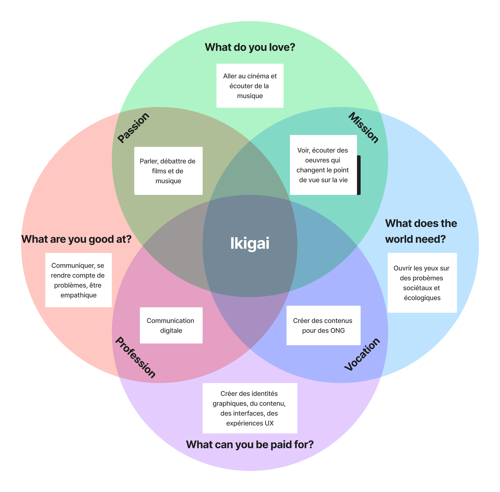

+++
title = "Le domaine de l'UX/UI et ce qui me lie à lui"
date = "2023-01-30"
description = "L'UX/UI et moi"
toc = true
+++

Dans cette page, je vais tout d'abord expliquer simplement ce que sont l'UX et l'UI, leur sous-domaines et leur taxonomie. Je vais ensuite vous expliquer mon histoire par rapport à ce corps de métier et ce qui me plait dans celui-ci. Finalement je vais vous montrer mon Ikigai.

## Définitions
> UX: l'expérience utilisateur, c'est l'ensemble des facteurs qui affectent les interactions d'un utilisateur avec un produit ou un service, y compris la convivialité, la facilité d'utilisation et la satisfaction.

>UI: l'interface utilisateur, c'est la manière dont un produit ou un service est présenté à l'utilisateur, y compris les éléments visuels et interactifs tels que les boutons, les icônes et les menus. 

> — <cite>ChatGPT</cite>

## Taxonomie 
Expérience, interface, interaction, empathie, utilisateurs, ergonomie, prototypes, recherches, Design, graphisme

## Sous-domaines
Recherches utilisateurs, architecture d'informations, design de solutions, design d'interfaces

## Pourquoi ce domaine ?
### Ma formation initiale
Avant ma formation d'ingénieur des médias, j'ai effectué un CFC d'automaticien. Cependant, je n'étais pas très bon dans mon métier. Mais il y a des tâches où j'étais le meilleur de ma volée; vulgariser et expliquer la formation aux personnes extérieures lors des portes ouvertes et créer les interface IHM. 
Je pense que ces deux qualités ont étées les prémices pour ma spécialsiation dans le domaine de l'UX et l'UI.

### Ce que j'aime dans dans l'UX et l'UI
J'aime tout d'abord le côté sociologique de l'UX, la psychologie qui se cache lorsque l'on essaye de comprendre pourquoi un utilisateur agit comme il le fait en fonction de qui il est. J'aime la démarche ingénieure de chercher ce qui pose problème et d'en trouver des solutions. Enfin, j'aime le côté rigoureux mais à la fois créatif que l'on peut trouver lors de designs d'interfaces.

## Mon Ikigai

